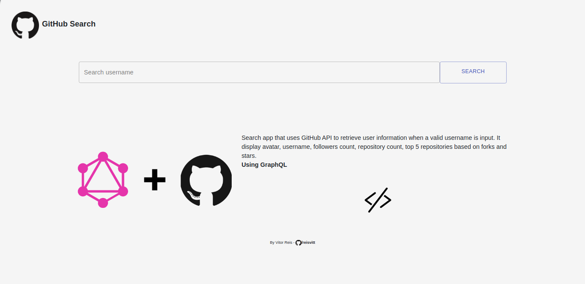

<h1>Search GitHub</h1>

A search aplication that uses GitHub API to retrieve user information when a valid username is input. It display avatar, username, followers count, repository count, top 4 repositories based on forks and stars.

It's based on one of these projects <a href="https://github.com/florinpop17/app-ideas" target="_blank">App ideas</a>. I recommend you see it.

<h4>Use</h4>

<ul>
  <li>React Js</li>
  <li>Axios</li>
  <li>Material UI</li>
</ul>
